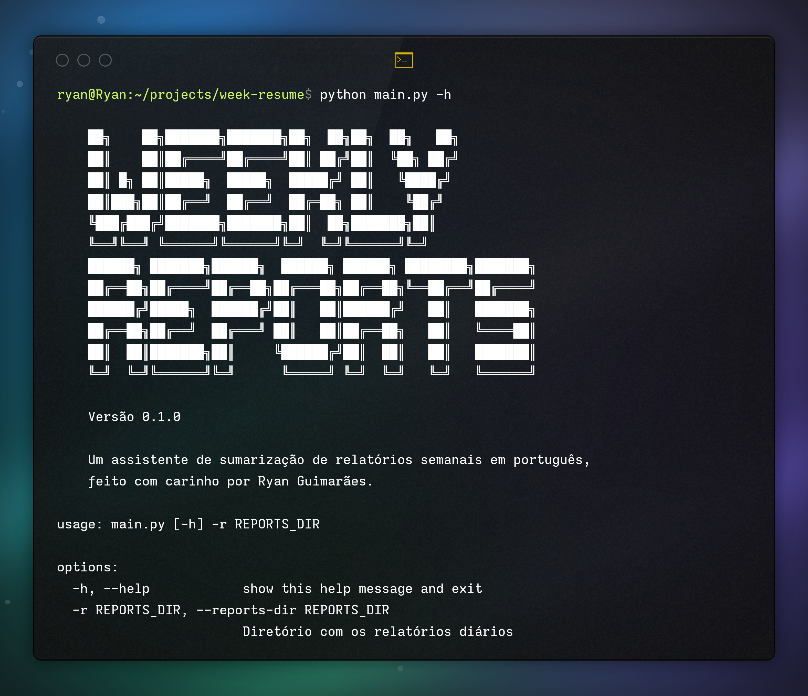

# 📝 Weekly Reports Summarizer 



<div align="center">
  
  
  
</div>

## 🌟 Overview

A powerful, intelligent weekly report summarization tool that transforms daily markdown reports into concise, insightful weekly summaries using AI technology.

## ✨ Features

- 🤖 AI-powered weekly report summarization
- 📂 Supports markdown daily report files
- 🇧🇷 Portuguese-focused summarization
- 🔍 Configurable AI model and instructions
- 💾 Automatic summary file generation

## 🚀 Quick Start

### Prerequisites

- Python 3.9+
- Google Gemini API Key
- Daily markdown reports

### Installation

1. Clone the repository:
```bash
git clone https://github.com/guimaraesr-y/weekly-reports-summarizer.git
cd weekly-reports-summarizer
```

2. Install dependencies:
```bash
pip install -r requirements.txt
```

3. Configure environment variables:
```bash
# Create a .env file
GEMINI_API_KEY=your_gemini_api_key
DEBUG=True  # Optional
```

### Usage

Basic usage:
```bash
python main.py -r /path/to/reports
```

Available options:
```
-r, --reports-dir    Directory containing daily report files (required)
-o, --output-dir     Directory for saving the summary (defaults to reports-dir)
-d, --end-date       End date for the week (format: YYYY-MM-DD)
-f, --format         Output format: txt or md (default: txt)
-v, --verbose        Enable verbose output
```

Examples:
```bash
# Generate summary for the current week
python main.py -r ./reports

# Generate summary with markdown format
python main.py -r ./reports -f md

# Generate summary for a specific week (ending on June 16, 2024)
python main.py -r ./reports -d 2024-06-16

# Save summary to a different directory
python main.py -r ./reports -o ./summaries
```

## 📋 Example

### Input: Daily Reports (Multiple markdown files)

```markdown
# Daily Report - 12/06/2024

- Started implementing new user authentication flow
- Fixed login page layout issues on mobile devices
- Attended team planning meeting
- Researched potential libraries for PDF generation
```

```markdown
# Daily Report - 14/06/2024

- Completed authentication flow implementation
- Created unit tests for new authentication components
- Started documentation for the new feature
- Helped QA team with bug reproduction steps
```

### Output: Weekly Summary

```markdown
## Relatório Semanal Simplificado (12/06 a 16/06)

**1. Atividades na Semana:**

*   Foco principal na implementação do novo fluxo de autenticação, incluindo implementação completa e testes unitários.
*   Correção de problemas de layout na página de login em dispositivos móveis.
*   Início da documentação para a nova funcionalidade.
*   Participação em reunião de planejamento da equipe.
*   Pesquisa de bibliotecas para geração de PDF.

**2. Resolução de Bugs:**

*   Corrigido problema de layout na página de login em dispositivos móveis.
*   Auxiliou equipe de QA com passos para reprodução de bugs.

**3. Trabalhando em Features:**

*   Fluxo de autenticação de usuários concluído e testado.
*   Documentação da nova funcionalidade em andamento.
*   Pesquisa para implementação de geração de PDF iniciada.

**Observações:** Houve boa colaboração com a equipe de QA para identificação e solução de problemas. A implementação do fluxo de autenticação foi concluída dentro do prazo previsto.
```

## 🔧 Configuration

Customize the summarizer through:
- `.env` file for API keys and settings
- Modify `ai/gemini.py` for different AI instructions
- Adjust `_get_weekly_reports()` method for specific report structures

## ✅ TODO

- [x] Make the structure flexible and user-friendly via terminal.
- [ ] Add support for custom output templates
- [ ] Implement batch processing for multiple weeks

## 🤝 Contributing

1. Fork the repository
2. Create your feature branch (`git checkout -b feature/AmazingFeature`)
3. Commit your changes (`git commit -m 'Add some AmazingFeature'`)
4. Push to the branch (`git push origin feature/AmazingFeature`)
5. Open a Pull Request

## 📄 License

Distributed under the MIT License. See `LICENSE` for more information.

---

**Made with ❤️ by Ryan Guimarães**